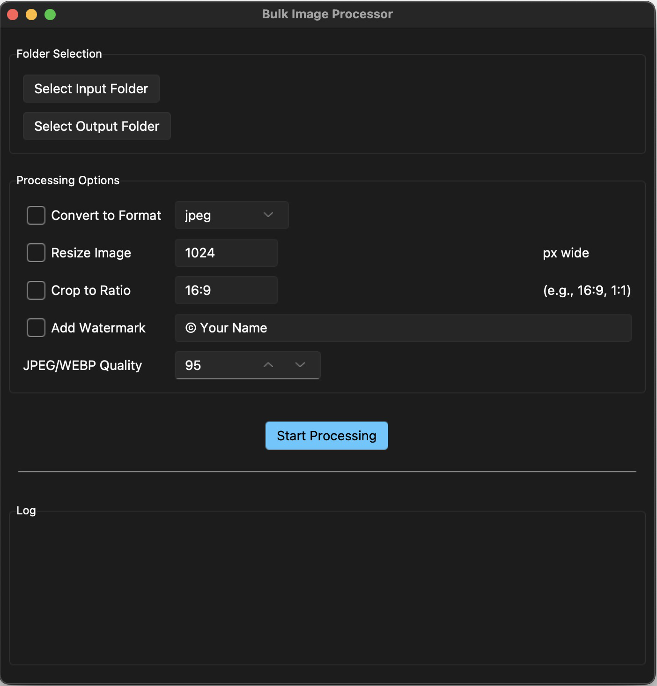

# Python Image Processor

[](https://www.python.org/downloads/)
[](https://opensource.org/licenses/MIT)
[](https://github.com/psf/black)

A user-friendly desktop application for bulk image processing. Built with Python and Tkinter, this tool provides both a graphical user interface (GUI) and a command-line interface (CLI) to automate repetitive image tasks.



---

## 🚀 Download & Installation (Recommended)

Get the latest standalone application for your operating system. No Python installation required!

1.  Go to the [**Releases Page**](https://github.com/KnowOneActual/python-image-processor/releases).
2.  Download the latest version for your operating system (e.g., `image-processor. macOS.app.zip` or `image-processor. WIN.app.zip`).
3.  Unzip the file if necessary and place the application in a convenient location.

### Running the Application

* **On Windows:** Double-click the `.exe` file.
* **On macOS:**
    1.  Double-click the application. You will likely see a warning that says the app cannot be opened because it is from an unidentified developer.
    2.  Click **OK** to close the warning.
    3.  Go to **System Settings** > **Privacy & Security**.
    4.  Scroll down to the "Security" section. You will see a message about the application being blocked.
    5.  Click the **"Open Anyway"** button. You will only need to do this the first time you run the app.
---

## ✨ Features

This tool's features aim to help make your image workflow faster and more efficient:

* **Desktop GUI Application**: An intuitive and modern interface that's easy for anyone to use.
* **Bulk Processing**: Process entire folders of images at once.
* **Format Conversion**: Convert between `jpeg`, `png`, `webp`, and `gif`.
* **Resizing**: Scale images to a specific width while maintaining the aspect ratio.
* **Center Cropping**: Crop images to a specific aspect ratio (e.g., `16:9`, `1:1`).
* **Watermarking**: Add a customizable text watermark to your images.
* **Quality Control**: Adjust the compression quality for `jpeg` and `webp` files to balance file size and quality.

---


## 💻 Running from Source

If you want to run the code directly follow these steps:

1.  **Clone the repository:**
    ```bash
    git clone [https://github.com/KnowOneActual/python-image-processor.git](https://github.com/KnowOneActual/python-image-processor.git)
    cd python-image-processor
    ```
2.  **Install the required libraries:**
    ```bash
    pip install -r requirements.txt
    ```
3.  **Run the GUI application:**
    ```bash
    python3 app.py
    ```


### Command-Line Usage

For automation and terminal users, the CLI provides access to all processing features.

**Basic Structure:**
```bash
python image_processor.py <input_dir> <output_dir> [options]
````

**Example:**

```bash
python image_processor.py ./input_images ./output_images --crop "1:1" --width 1080 --format jpeg
```

For a full list of commands and options, run:

```bash
python image_processor.py --help
```

## 🛣️ Roadmap

This project is actively maintained. Future enhancements may include:

  * Adding more advanced filename options (e.g., adding a prefix or suffix).
  * Support for additional image effects (e.g., brightness, contrast).
 
 Please feel free to open an issue or submit a pull request.
